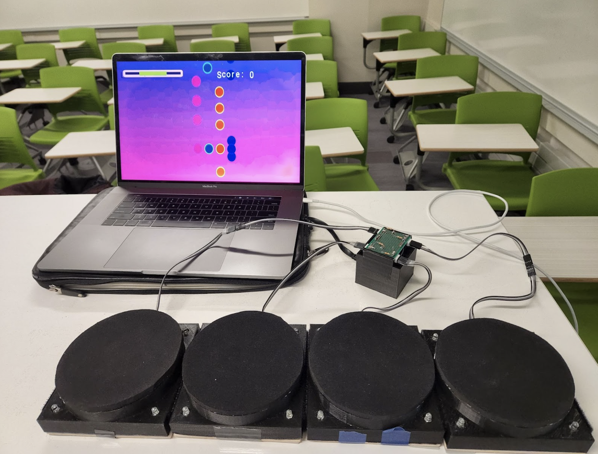
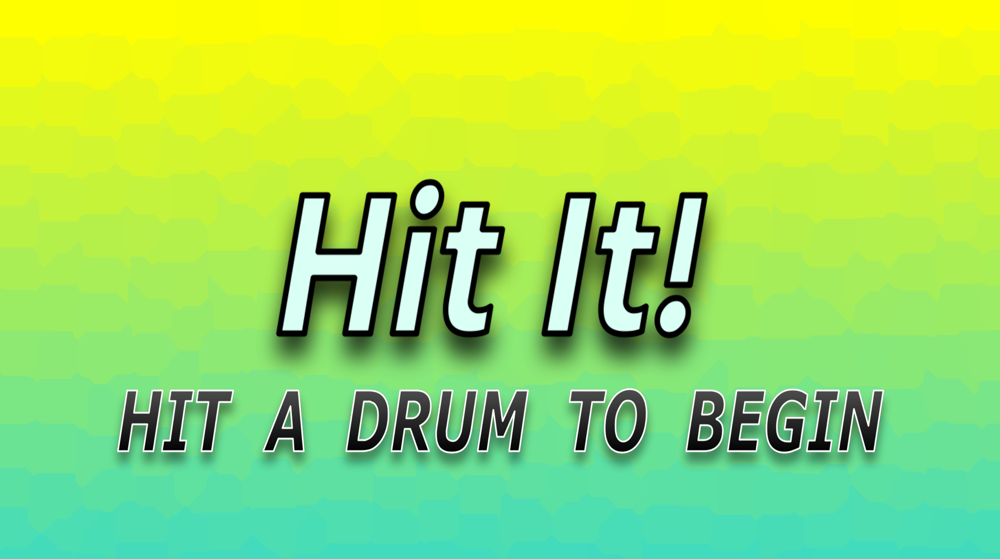
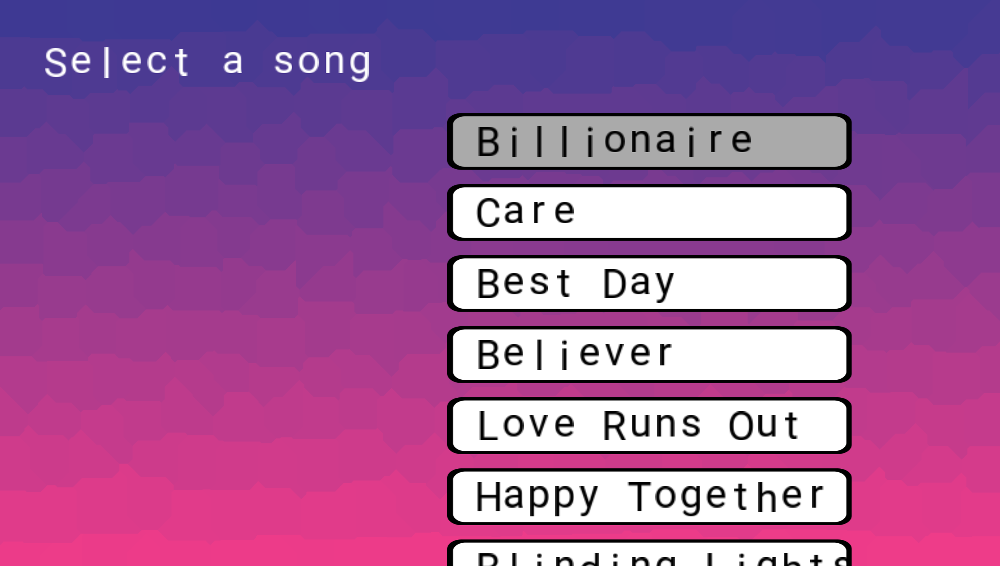
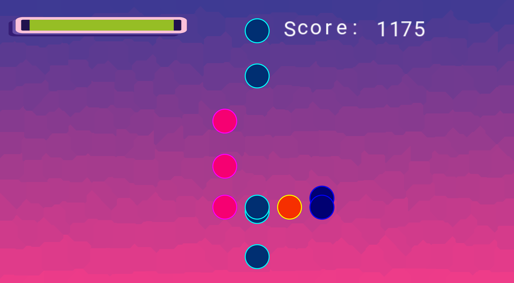

# ECE Capstone Project - Rhythm Game

## Compiling the game
CMake is used to create the compilation command for this game. Make sure you have CMake intalled before proceeding. https://cmake.org/install/

First, open a terminal and change the working directory to the root of this repository. Then run these commands:
`cmake -S . -B build`
`cd build`
`make -j10`

## Running the game
To play the game, just run the executable: `./RhythmGame`

## Libraries Used
* glm 0.9.9.8 https://github.com/g-truc/glm/releases/tag/0.9.9.8
* GLFW 3.3.6 https://www.glfw.org/download.html
* glad https://github.com/Dav1dde/glad
    - "Go to the GLAD web service, make sure the language is set to C++, and in the API section 
    select an OpenGL version of at least 3.3 (which is what we’ll be using; higher versions are 
    fine as well). Also make sure the profile is set to Core and that the Generate a loader option 
    is ticked. Ignore the extensions (for now) and click Generate to produce the resulting library 
    files". Quote copied from "Learn OpenGL - Graphics Programming" by Joey de Vries 
* PortAudio - http://www.portaudio.com/
* libaudiodecoder - https://github.com/asantoni/libaudiodecoder

## Credits 
* window creation code taken from "Learn OpenGL - Graphics Programming" by Joey de Vries 
https://learnopengl.com 
* *Mode.cpp*, *Mode.hpp*, *Sound.cpp* and render loop code based off "game 0" and "game 3" base code from Computer Game 
Programming 16-466 at CMU https://github.com/15-466/15-466-f21-base0 
